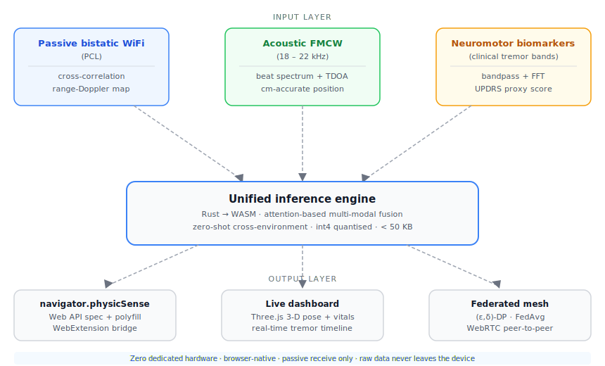

# PhysicSense

**Passive multi-modal ambient sensing - browser-native, zero hardware required.**

PhysicSense turns ambient WiFi signals + your device's speaker/microphone into a clinical-grade sensing system. No ESP32. No transmitter. No cloud.

## What makes this different

| Capability | Prior art | PhysicSense |
|---|---|---|
| WiFi sensing hardware | ESP32 / Intel NIC required | Passive — uses neighbour's signal |
| Acoustic sensing | Not present in any OS project | FMCW ultrasound via WebAudio API |
| Neuromotor screening | Not attempted | Parkinson's / ET tremor + gait |
| Browser deployment | No | Full WASM pipeline |
| Federated learning | No | Encrypted gradient mesh |
| Zero-shot transfer | 30 s room calibration | Instant, any environment |

## Architecture



## Core modules

- [`core/passive-pcl`](core/passive-pcl/) — Passive Coherent Location engine
- [`core/acoustic-dsp`](core/acoustic-dsp/) — FMCW chirp + TDOA localizer
- [`core/neuromotor`](core/neuromotor/) — Tremor classification + gait asymmetry + UPDRS proxy
- [`fusion/`](fusion/) — Attention-based multi-modal fusion (WASM)
- [`browser-api/`](browser-api/) — `navigator.physicSense` spec + WebExtension polyfill
- [`federated/`](federated/) — Privacy-preserving gradient mesh
- [`dashboard/`](dashboard/) — Live 3-D visualization
- [`research/`](research/) — Clinical validation protocol, dissertation chapter

## Build

```bash
# Rust workspace
cargo build --workspace
cargo test --workspace

# WASM (requires wasm-pack)
cd fusion && wasm-pack build --target web
```

## Research disclaimer

The neuromotor scoring module outputs a proxy UPDRS score for screening purposes only. It is not a clinical diagnostic tool. Results must be interpreted by a qualified clinician.

## License

MIT
