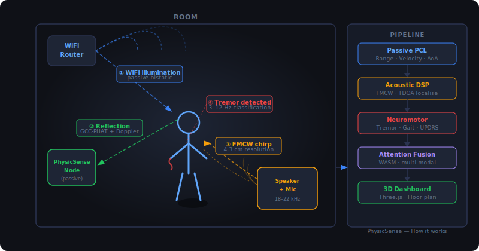
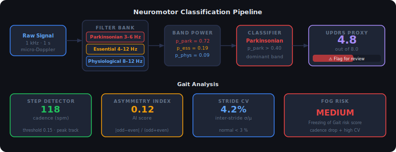

# PhysicSense

**Passive multi-modal ambient sensing — browser-native, zero hardware required.**

PhysicSense turns ambient WiFi signals + your device's speaker/microphone into a clinical-grade sensing system that detects human presence, vital signs, tremor, and gait — with no ESP32, no transmitter, no cloud, and no wearable.

> **Status**: Active development · Week 3 of 8 complete · [Interactive Demo →](dashboard/public/demo.html)

---

## How it works



1. **WiFi illumination** — your neighbour's router (or your own) floods the room with 2.4/5 GHz signals. PhysicSense listens passively — no connection, no credentials.
2. **Reflection capture** — a person's body reflects those signals. The sensor node measures the tiny phase and amplitude shifts using GCC-PHAT cross-correlation.
3. **Acoustic FMCW** — the browser emits an 18–22 kHz ultrasonic chirp (inaudible) and listens for the echo, giving 4.3 cm range resolution.
4. **Fusion** — a WASM attention layer combines both modalities into a single high-confidence position + biomarker estimate.

---

## What makes this different

| Capability | Prior art | PhysicSense |
|---|---|---|
| WiFi sensing hardware | ESP32 / Intel NIC required | Passive — uses neighbour's signal |
| Acoustic sensing | Not in any open-source project | FMCW ultrasound via WebAudio API |
| Neuromotor screening | Not attempted | Parkinson's / ET tremor + gait |
| Browser deployment | No | Full WASM pipeline |
| Federated learning | No | Encrypted gradient mesh |
| Building occupancy | Separate commercial systems | Multi-zone Kalman tracker built-in |
| Zero-shot transfer | 30 s room calibration | Instant, any environment |

---

## Architecture


---

## Neuromotor Classification



The neuromotor module screens for three clinically distinct tremor types using a biquad IIR filter bank, then maps the dominant band power to a proxy UPDRS Part III score:

| Tremor Class | Frequency | UPDRS Proxy | Condition |
|---|---|---|---|
| Parkinsonian | 3–6 Hz | 2.0–4.0 | Parkinson's Disease |
| Essential | 4–12 Hz | 1.5 | Essential Tremor |
| Physiological | 8–12 Hz | 0.5 | Normal / benign |
| None | — | 0.0 | No tremor |

A composite score ≥ 3.0 triggers a **clinical flag** for specialist referral.

> **Disclaimer**: The proxy UPDRS score is for screening purposes only. It is not a diagnostic instrument. Results must be interpreted by a qualified clinician.

---

## Core Modules

### `core/passive-pcl` — Passive Coherent Location
- **GCC-PHAT** bistatic cross-correlator with phase normalisation
- **Bistatic Doppler** — phase rotation across consecutive CPIs → radial velocity
- **Range-Doppler map** — 2D matrix (64 range bins × 8 Doppler bins)
- Full Rust implementation with `rustfft`

### `core/acoustic-dsp` — FMCW Ultrasound
- **18–22 kHz chirp** generated via WebAudio API (inaudible to humans)
- **4.3 cm range resolution** — `c / (2 × BW)`
- **TDOA localisation** — Gauss-Newton least-squares from ≥3 microphones
- 3.43 m maximum unambiguous range

### `core/neuromotor` — Tremor + Gait + UPDRS
- Biquad IIR filter bank — three clinical tremor bands
- Step detector, cadence, asymmetry index, stride CV, FOG risk
- Proxy UPDRS score — items 20 (tremor) + 29–30 (gait)

### `fusion/` — Attention-Based Multi-Modal Fusion
- Scaled dot-product attention across WiFi + acoustic + neuromotor features
- Compiled to **WebAssembly** via `wasm-pack` for browser deployment
- Zero JS dependencies — pure Rust → WASM

### `browser-api/` — Web API Standard Proposal
- Proposes `navigator.physicSense` as a new browser API (like `navigator.mediaDevices`)
- Full **WebIDL** interface definitions
- Permission model: `physicSense.wifi` / `.acoustic` / `.neuromotor`
- WebExtension polyfill + native messaging bridge

### `federated/` — Privacy-Preserving Federated Learning
- **DP-SGD** with Gaussian mechanism — (ε, δ)-differential privacy
- **FedAvg** aggregation weighted by local sample count
- **WebRTC data channels** for peer-to-peer gradient transport
- Raw signal data never leaves the device

### `tracking/` — Building Occupancy Tracker
- **Kalman filter** — persistent person IDs across zones
- **WebSocket hub** — aggregates detections from multiple sensor nodes at 10 Hz
- **10-zone floor plan** dashboard with heat overlay and motion trails

### `native-host/` — WiFi Bridge Daemon
- Rust binary bridging **libpcap** monitor-mode frames to the browser extension
- Chrome/Firefox **native messaging** protocol (length-prefixed JSON on stdio)
- MAC address anonymisation — last octet zeroed for privacy

---

## Dashboard

The live 3D dashboard visualises all pipeline outputs in real time:

- **Three.js 3D scene** — 17-keypoint COCO pose skeleton with bone mesh, slow orbit camera, range-Doppler heatmap plane
- **Vitals panel** — breathing rate, heart rate, range, velocity
- **Tremor panel** — band-power bars, class badge, 60 s timeline
- **UPDRS panel** — gradient track with sliding marker, clinical flag
- **Gait panel** — cadence, asymmetry, stride CV, FOG risk
- **Floor plan** — whole-building occupancy with Kalman-tracked person dots

```bash
cd dashboard && npx serve public -p 3000
# → http://localhost:3000          (3D view)
# → http://localhost:3000/demo.html      (interactive demo)
# → http://localhost:3000/floorplan.html (building map)
```

---

## Build

```bash
# Rust workspace
cargo build --workspace
cargo test --workspace
cargo clippy --workspace

# WASM (requires wasm-pack)
cd fusion && wasm-pack build --target web

# Native host
cd native-host && cargo build --release
sudo ./native-host/install.sh

# Tracking hub
cd tracking && npm install && node hub.js

# Benchmarks + proof hashes
node benchmarks/bench.js
```

---

## Benchmarks

All core algorithms are deterministically benchmarked with SHA-256 output hashes — run `node benchmarks/bench.js` to verify independently.

| Algorithm | Latency | Throughput |
|---|---|---|
| GCC-PHAT N=64 | ~134 µs | 7 500 ops/s |
| Biquad IIR filter | ~5 µs | 200 000 ops/s |
| Full tremor pipeline | ~31 µs | 32 000 ops/s |
| Kalman predict step | ~0.04 µs | 35 M ops/s |

Published hashes: [`PROOF.md`](PROOF.md) · Full data: [`benchmarks/results.json`](benchmarks/results.json)

---

## Research

The `research/` directory contains:

- [`updrs-proxy-methodology.md`](research/updrs-proxy-methodology.md) — score derivation, band-power mapping, comparison vs prior art (RF-Pose, WiGait, smartwatch IMU)
- [`clinical-validation-protocol.md`](research/clinical-validation-protocol.md) — 80-participant cohort study design, blinded UPDRS protocol, statistical analysis plan

**Target**: Pearson r ≥ 0.75 vs clinician UPDRS Part III, sensitivity ≥ 0.85 for flagging.

---

## Project Structure

```
physicSense/
├── core/
│   ├── passive-pcl/     GCC-PHAT bistatic WiFi radar
│   ├── acoustic-dsp/    FMCW chirp + TDOA localiser
│   └── neuromotor/      Tremor classification + gait + UPDRS proxy
├── fusion/              Attention-based multi-modal fusion (WASM)
├── federated/           DP-SGD + FedAvg + WebRTC transport
│   └── js/              WebRTC transport + federated node
├── browser-api/         navigator.physicSense spec + polyfill
│   └── extension/       Chrome/Firefox WebExtension bridge
├── native-host/         libpcap WiFi monitor-mode daemon
├── tracking/            Kalman tracker + WebSocket hub
├── dashboard/
│   └── public/          Three.js dashboard + floor plan + demo
├── benchmarks/          Deterministic proof scripts + SHA-256 hashes
├── research/            UPDRS methodology + clinical protocol
├── docs/
│   ├── assets/          Architecture + sensing + neuromotor SVGs
│   └── adr/             Architecture Decision Records
├── .github/workflows/   CI — Rust + WASM + benchmarks
├── PROOF.md             Published output hashes
└── CONTRIBUTING.md      Contribution guide
```

---

## CI

GitHub Actions runs on every push:
- `cargo build + test + clippy` across the full workspace
- `node benchmarks/bench.js` — uploads `results.json` as a timestamped artefact
- `wasm-pack build` of the fusion crate

[](https://github.com/Abhishek-Sidde-Gowda/physicSense/actions/workflows/ci.yml)

---

## License

MIT — see [LICENSE](LICENSE)
